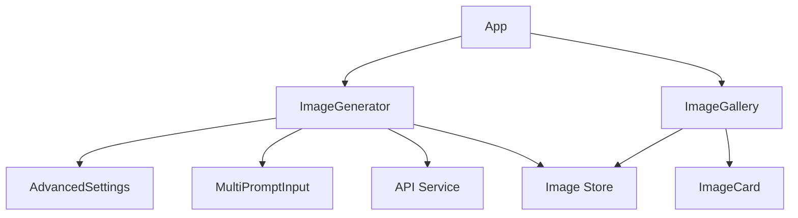

## AI Image Generator Project Structure

### Core Files and Their Relationships

#### Entry Points
- `src/main.tsx`
  - Main application entry point
  - Renders the App component
  - Initializes global styles

- `src/App.tsx`
  - Root component
  - Manages layout structure
  - Integrates Toast notifications
  - Houses ImageGenerator and ImageGallery components

#### Component Architecture

1. **Image Generation (`src/components/`)**
   - `ImageGenerator.tsx`
     - Main form component
     - Manages generation state
     - Integrates with API service
     - Uses:
       - AdvancedSettings
       - MultiPromptInput
       - ImageUpload functionality
       - Toast notifications

   - `AdvancedSettings.tsx`
     - Controls for generation parameters
     - Manages:
       - Generation modes
       - Style presets
       - Technical parameters (CFG, steps, etc.)
     - Used by: ImageGenerator

   - `MultiPromptInput.tsx`
     - Handles multiple prompt inputs
     - Weight management for each prompt
     - Used by: ImageGenerator

2. **Gallery System (`src/components/`)**
   - `ImageGallery.tsx`
     - Displays generated images
     - Manages image grid layout
     - Uses: ImageCard

   - `ImageCard.tsx`
     - Individual image display
     - Handles:
       - Image download
       - Deletion
       - Settings display
       - Generation details

#### State Management (`src/store/`)
- `useImageStore.ts`
  - Zustand store implementation
  - Manages:
    - Generated images
    - Storage limits
    - Persistence
  - Used by:
    - ImageGenerator
    - ImageGallery

#### API Integration (`src/services/`)
- `api.ts`
  - Stability AI API integration
  - Handles:
    - Text-to-Image
    - Image-to-Image
    - Upscaling
  - Used by: ImageGenerator

#### Configuration (`src/config/`)
- `env.ts`
  - Environment configuration
  - API key management
  - Used throughout the application

#### Utility Functions (`src/utils/`)
- `dateUtils.ts`
  - Date formatting utilities
  - Used by: ImageCard

- `downloadUtils.ts`
  - Image download functionality
  - Used by: ImageCard

#### Type Definitions (`src/types.ts`)
- Contains all TypeScript interfaces
- Defines:
  - API responses
  - Component props
  - Store state
  - Settings interfaces

#### Constants (`src/constants.ts`)
- Application-wide constants
- Defines:
  - Style presets
  - Default settings
  - Generation modes
  - Prompt suggestions

### Data Flow

1. **Image Generation Flow**
   ```
   User Input → ImageGenerator
     ↓
   AdvancedSettings/MultiPromptInput
     ↓
   API Service
     ↓
   Image Store
     ↓
   Gallery Display
   ```

2. **Storage Flow**
   ```
   Generated Image → Image Store
     ↓
   Local Storage
     ↓
   Gallery Component
   ```

3. **Settings Flow**
   ```
   AdvancedSettings → ImageGenerator
     ↓
   API Service
     ↓
   Generation Result
   ```

### Component Dependencies



### State Management Structure

```typescript
Store {
  images: GeneratedImage[]
  addImage(image: GeneratedImage)
  removeImage(id: string)
  clearImages()
}
```

### API Integration Points

1. **Text-to-Image**
   - Endpoint: `/v1/generation/stable-diffusion-xl-1024-v1-0/text-to-image`
   - Component: ImageGenerator
   - Flow: Prompts → API → Store

2. **Image-to-Image**
   - Endpoint: `/v1/generation/stable-diffusion-xl-1024-v1-0/image-to-image`
   - Component: ImageGenerator
   - Flow: Image + Prompts → API → Store

3. **Upscaling**
   - Endpoint: `/v2beta/stable-image/upscale/{mode}`
   - Component: ImageGenerator
   - Flow: Image → API → Store

### Error Handling

- API errors: Managed in api.ts
- UI feedback: Toast notifications
- Storage limits: Handled in store
- Upload validation: ImageGenerator component

### Performance Considerations

1. **Image Loading**
   - Lazy loading in gallery
   - Progressive image loading
   - Blob handling for uploads

2. **Storage Management**
   - Size limits
   - Automatic cleanup
   - Quota management

3. **State Updates**
   - Efficient re-renders
   - Memoized callbacks
   - Optimized store updates

### CSS Structure

1. **Global Styles**
   - Tailwind base styles
   - Custom utility classes
   - Component-specific styles

2. **Component Styling**
   - Consistent class naming
   - Responsive design
   - Theme variables

This structure provides a comprehensive overview of the project's architecture and component relationships, making it easier to understand and maintain the codebase.